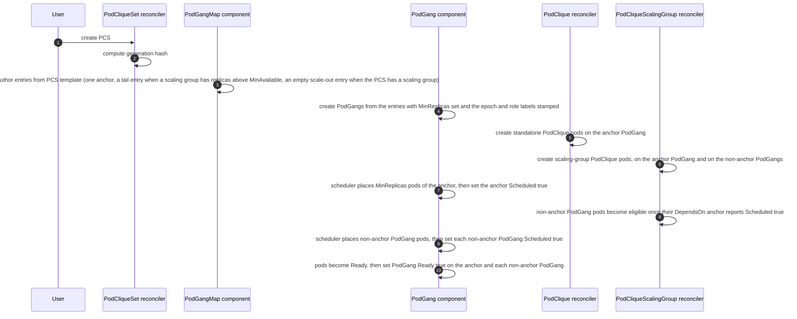
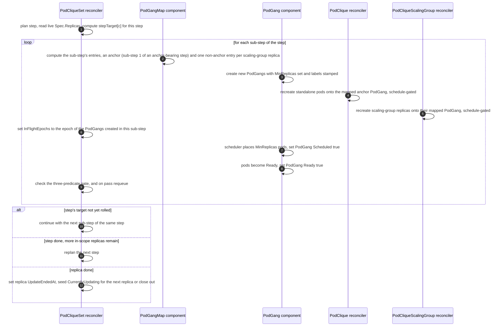
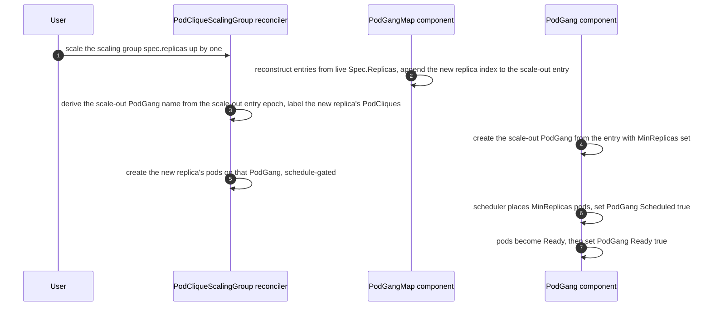
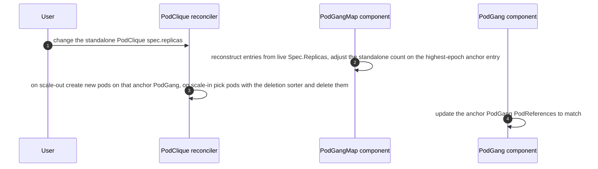

# GREP-393: Coherent Rolling Updates


<!-- toc -->
- [Summary](#summary)
- [Motivation](#motivation)
  - [Why cross-version communication is considered unsafe in Disaggregated Inference?](#why-cross-version-communication-is-considered-unsafe-in-disaggregated-inference)
  - [Goals](#goals)
  - [Non-Goals](#non-goals)
- [Abbreviations](#abbreviations)
- [Proposal](#proposal)
  - [PodGang roles](#podgang-roles)
  - [User Stories](#user-stories)
    - [Story 1](#story-1)
    - [Story 2](#story-2)
  - [Limitations/Risks &amp; Mitigations](#limitationsrisks--mitigations)
- [Design Details](#design-details)
  - [API Changes](#api-changes)
    - [UpdateStrategyType — Coherent is the default](#updatestrategytype--coherent-is-the-default)
    - [RollingUpdateConfiguration — per-component update knobs](#rollingupdateconfiguration--per-component-update-knobs)
    - [RollingUpdate defaulting and validation](#rollingupdate-defaulting-and-validation)
    - [PodGangMap — new CRD](#podgangmap--new-crd)
    - [PodCliqueSetStatus.UpdateProgress extensions for Coherent update strategy](#podcliquesetstatusupdateprogress-extensions-for-coherent-update-strategy)
      - [Capturing MVU scope in PodCliqueSetUpdateProgress](#capturing-mvu-scope-in-podcliquesetupdateprogress)
      - [Cascading updates and multi-generation PodGangMap](#cascading-updates-and-multi-generation-podgangmap)
      - [Per-replica sub-step tracking on PodCliqueSetReplicaUpdateProgress](#per-replica-sub-step-tracking-on-podcliquesetreplicaupdateprogress)
    - [Labels on PodGang resources](#labels-on-podgang-resources)
  - [Gang scheduling during initial deployment of PCS](#gang-scheduling-during-initial-deployment-of-pcs)
  - [Coherent update behavior and flow](#coherent-update-behavior-and-flow)
    - [Actors and responsibilities](#actors-and-responsibilities)
    - [PodGangMap as the single source of truth](#podgangmap-as-the-single-source-of-truth)
    - [Planning a coherent update: Step and Sub-step planning](#planning-a-coherent-update-step-and-sub-step-planning)
      - [Step plan](#step-plan)
      - [Worked examples](#worked-examples)
        - [Full Update](#full-update)
        - [Partial Update](#partial-update)
      - [Per-sub-step gate](#per-sub-step-gate)
    - [Coherent update flow](#coherent-update-flow)
      - [Bootstrap (initial PCS deploy)](#bootstrap-initial-pcs-deploy)
      - [One coherent update step](#one-coherent-update-step)
      - [Steady-state scaling group scale-out and scale-in](#steady-state-scaling-group-scale-out-and-scale-in)
      - [Steady-state standalone PodClique scale-out and scale-in](#steady-state-standalone-podclique-scale-out-and-scale-in)
    - [PodGang.MinReplicas lifecycle and conditions](#podgangminreplicas-lifecycle-and-conditions)
      - [MinReplicas clamping on non-MinAvailable anchors](#minreplicas-clamping-on-non-minavailable-anchors)
    - [Gang termination suppression during updates](#gang-termination-suppression-during-updates)
    - [DependsOn and scheduling order](#dependson-and-scheduling-order)
    - [PodGang naming convention](#podgang-naming-convention)
  - [PodGang label preservation contract](#podgang-label-preservation-contract)
  - [Update concurrency](#update-concurrency)
  - [Handling scale-outs and scale-ins during update](#handling-scale-outs-and-scale-ins-during-update)
  - [Monitoring](#monitoring)
  - [Dependencies](#dependencies)
  - [Graduation Criteria](#graduation-criteria)
<!-- /toc -->

## Summary

Disaggregated inference architectures split LLM serving into distinct phases — most commonly (but not limited to) **prefill** (context generation) and **decode** (token generation) — running as separate, independently scalable components. While this can improve throughput and hardware utilisation, it introduces a hard operational constraint during version upgrades: prefill and decode instances that communicate must always run compatible software versions. This proposal introduces **Coherent Rolling Updates** for `PodCliqueSet`, enabling availability-preserving software upgrades that progress in bounded steps. Each step pairs an atomic **Minimum Viable Unit (MVU)** — the smallest set of components that must come up together at the new version to remain compatible — with subsequent tail sub-steps that drain the remainder under a per-component **`MaxUnavailable`** disruption budget. `Coherent` is the default `UpdateStrategy` for `PodCliqueSet`.

## Motivation

Inference frameworks (e.g., vLLM, SGLang, TensorRT-LLM) support disaggregated LLM serving, where stages like prefill and decode run as separate, networked components. While this can improve throughput and resource efficiency, it complicates standard deployment practices. A standard Kubernetes rolling update inevitably creates a period where old and new version pods run at the same time and may communicate. In disaggregated systems, this cross-version communication is unsafe, so applications must prevent it. However, once cross-version communication is disabled, rolling updates introduce another issue: different components often update at different rates, which leads to mismatched pools of compatible instances. For example, you might still have many old-version prefill instances running while most old-version decode instances have already been replaced. Since old prefill can only talk to old decode, a portion of the prefill capacity becomes unusable due to the lack of matching decode capacity. This kind of mismatch reduces effective end-to-end serving capacity during the update. Our goal is to design a rolling update strategy that maintains balanced, compatible capacity across components, with operator control over how much capacity may be unavailable at any moment.

### Why cross-version communication is considered unsafe in Disaggregated Inference?

AI inference frameworks are evolving rapidly as new architectures/models are released, prioritising performance optimisations over backwards compatibility between versions. In aggregated serving this is generally acceptable — model instances are self-contained within pods of the same version, so internal format changes are invisible to the deployment layer. In disaggregated serving, however, as explained above, a naive rolling update could result in cross-version communication where an old-version prefill may attempt a KV-cache transfer to a new-version decode. Across versions, any number of things can change and break this contract — the KV-cache data layout (dtype, dimension ordering, block size), the protocol used for the transfer handshake, even user-specified updates to the sharding strategy across new versions etc. Ultimately since the kv-cache managers are not backwards compatible and often optimized there is no guarantee that cross version communication is safe and its fairly likely that it is not safe.

### Goals

* Enable rolling updates at a user-chosen granularity: the user selects which components to update in one event, and the system replaces them in lockstep within each MVU so cross-version mixing within the boundary is impossible.
* Each MVU is gang-scheduled as a single unit, so an MVU's pods either come up together at the new version or none of them do.
* Preserve `PodCliqueSet` availability during rolling updates to serve incoming traffic with sets of compatible interdependent components.
* Provide a per-component **`MaxUnavailable`** knob that bounds the worst-case disruption per step, so operators can dial the tradeoff between rollout speed and serving capacity preserved during the rollout.

### Non-Goals

* Ensure equal or better topology optimized placement of the workload after rolling update.
* Explicit support for `maxSurge`. A future iteration will add `maxSurge` to the same per-component update configuration that carries `MaxUnavailable` today.
* User-configurable concurrency control during a coherent update — neither the number of `PodCliqueSet` replicas updated simultaneously nor the number of MVU steps in flight per replica is configurable in the current iteration. Both default to one. Configurable knobs will be supported in future.
* `scale-out` and `scale-in` of scale sub-resources (`PodClique`, `PodCliqueScalingGroup`, `PodCliqueSet`) during a coherent update. The current iteration rejects these operations PCS-wide for the duration of an in-flight coherent update — see [Handling scale-outs and scale-ins during update](#handling-scale-outs-and-scale-ins-during-update) for the precise scope and rationale. Narrower per-replica scoping and otherwise composing scale operations with an in-flight coherent update will be supported in future iterations.
* Rollback and roll-forward of `PodCliqueSet` revisions. Tracking PCS revision history and providing operator-driven rollback / roll-forward to a prior version will be supported in future.
* Solving cross-version communication between updating and existing components. This iteration leaves that concern to the application — the data plane is responsible for ensuring traffic respects version compatibility. As stated in [Motivation](#motivation), the goal of Coherent is to design a rolling update strategy that maintains balanced, compatible capacity across components, with operator control over how much capacity may be unavailable at any moment. A primitive for application-level routing or proportional traffic selection by revision can be added in a future increment if the need arises.

## Abbreviations

Throughout this proposal we will be using these short forms for brevity:

| Long Form             | Short Form |
| --------------------- | ---------- |
| PodCliqueSet          | PCS        |
| PodCliqueScalingGroup | PCSG       |
| PodClique             | PCLQ       |
| PodGang               | PG         |
| PodGangMap            | PGM        |
| Minimal Viable Unit   | MVU        |

> ***NOTE:*** `PGM` is the PodGangMap, a new custom resource introduced by this GREP. The other rows abbreviate existing resources.

## Proposal

The GREP introduces a new rolling update strategy, named **Coherent Rolling Updates**, based on the concept of a **Minimal Viable Unit** (a.k.a. MVU).

An MVU is **the set of `MinAvailable` replicas of every component the user has changed in this update event**. The user implicitly defines the compatibility boundary: it is exactly the set of components touched in this update event. Changing only one component (e.g. only `decode`) produces an MVU that contains MinAvailable replicas of just that component; changing multiple components in a single update event (e.g. `prefill` and `decode` together for a non-backward-compatible upgrade) produces an MVU that contains MinAvailable replicas of each.

Components the user has not changed in this update event are not part of the MVU. They continue to run unhindered in their existing PodGangs and are not co-rolled. This is what makes Coherent updates granular: the disruption per update event is bounded by what the user actually changed.

If pods in different PodCliques can't communicate safely across disaggregation boundaries because their software versions are incompatible, updating all pods in an MVU as a unit (rather than individually) eliminates mixed-version imbalance for the components inside the boundary the user has drawn.

### PodGang roles

Coherent expresses the MVU model with three roles that a PodGangMap entry can take, plus two legacy PodGang shapes it recognizes for migration. The role is recorded on the entry and mirrored onto each materialized PodGang as the `grove.io/podgang-role` label.

| Role | New or legacy | When created | What it holds |
| ---- | ------------- | ------------ | ------------- |
| Anchor | New | At bootstrap, and at the first sub-step of every anchor-bearing step of a coherent update. | The MinAvailable replicas of every in-scope component, the standalone PodClique pod counts and the MinAvailable replica indices of every scaling group. It is the smallest PodGang that satisfies availability. |
| Tail | New | During a coherent update, and at bootstrap when a scaling group has replicas above MinAvailable. | Scaling group replica indices above MinAvailable. Its PodGang depends on an anchor epoch via `DependsOn`, so the scheduler places it only after that anchor is scheduled. |
| ScaleOut | New | Once per PodGangMap when the PCS has at least one scaling group. It starts empty and later scale-outs append their new replica indices to it. | Scaling group replica indices added by steady-state scale-out. Its PodGang depends on an anchor epoch via `DependsOn`. |
| Base PodGang | Legacy | Initial deployment under a pre-Coherent strategy, before the migration. | One per PCS replica, carrying MinAvailable replicas of every standalone PodClique and every scaling group. |
| Scaled PodGang | Legacy | One per scaling group replica above MinAvailable under a pre-Coherent strategy, before the migration. Named `<pcsg-fqn>-<index>`. | A single scaling group replica. |

A single PCS replica can hold a mix of the three new roles at once. Mid-update a replica can still carry its old-generation anchor and tail PodGangs alongside the new-generation ones, until the old ones are fully drained.

The base and scaled PodGangs are the pre-Coherent shapes. A one-time migration converts every PodCliqueSet to the epoch-based PodGang naming and the PodGangMap. It is gated by the `PodGangMigrationInProgress` condition set before the controller manager starts, so the PodClique and PodCliqueScalingGroup reconcilers wait until it finishes. The migration builds the epoch-based PodGangMap, relabels each PodClique and its pods onto the new epoch-based PodGang name, and lets the PodGang component create the new PodGangs. The legacy-named PodGangs are dropped once empty. This migration is **mandatory**, and once it has run the legacy base and scaled PodGang names cease to exist, so the rest of the operator deals only with the epoch-based scheme. New PodCliqueSet deployments use the anchor, tail, and scale-out roles from t=0.

### User Stories

#### Story 1

As a platform engineer operating a disaggregated inference deployment (e.g., prefill and decode components) using modern inference frameworks (such as vLLM, SGLang, or TensorRT-LLM), I need to safely roll out new software versions where components are not backward compatible across versions. During an upgrade, prefills running the old version must not attempt to communicate with decodes running the new version (and vice versa), as this can lead to crashes, corrupted KV transfers, or undefined behavior.

The system must update prefill and decode pods together as a single atomic unit (MVU), ensuring that at no point does an old-version prefill hand off a KV-cache block to a new-version decode, or vice versa. While the update is in progress, replicas that have not yet been updated must continue serving traffic using only old-version components, and replicas that have already been updated must serve using only new-version components. The update should proceed replica-by-replica (or MVU-by-MVU within a replica) without requiring a full deployment restart, so that overall serving capacity is preserved throughout the rollout.

#### Story 2

As an ML infrastructure team member deploying a disaggregated inference system where the prefill tier and decode tier are updated on different release cadences, I need to independently update only the decode `PodClique` (e.g., to pick up a memory-efficiency fix) without touching the prefill `PodClique`. The system should recognise this as a backward-compatible, single-component update, replace decode pods incrementally — at most `MaxUnavailable` decode pods at a time so the rest continue serving — and leave prefill pods untouched, all without requiring a full MVU replacement.

### Limitations/Risks & Mitigations

The current iteration of Coherent Rolling Updates carries the following known limitations. Each is a deliberate scope boundary, with planned follow-up where applicable.

1. **No surge-style availability headroom during a coherent update.** Coherent always replaces in place — pods of an updated component are taken down before their new-version replacements are created.

   *Mitigation:* operators who need additional availability headroom during a coherent update can either:
   - Provision more replicas at the PCLQ / PCSG level (so MinAvailable < Replicas, and the surplus continues serving while the MinAvailable floor is rolled), or
   - Provision more PCS replicas (so a fraction of the fleet is always at a non-updating replica index).

2. **Initial PCS deployment ungates all non-anchor pods at once.** A freshly created `PodCliqueSet` lays out one anchor PodGang carrying the full standalone-PodClique count plus `MinAvailable` of every scaling group, one tail PodGang per scaling group replica above `MinAvailable`, and an empty scale-out entry. All the tail pods have their scheduling gates lifted in a single batch once the anchor reports `Scheduled=True`.

   The cost shows up at gate removal. The backend scheduler sees the full pool of tail pods become eligible at the same instant. Under capacity pressure the scheduler's choice of placement order determines the running distribution across scaling groups, and it is free to favor one scaling group over another. The result can be a skewed allocation of running replicas across scaling groups even though every tail pod was eligible. A coherent update does not have this issue because gate removal is paced by sub-steps and `MaxUnavailable`, so only a small batch of tail pods becomes eligible at a time.

   *Mitigation:* none in this iteration. Pacing the initial deployment the way a coherent update paces its sub-steps is left to a future iteration.

3. **Preemption between sub-steps throttles or stalls the rollout.** Predicate 3 of the [Per-sub-step gate](#per-sub-step-gate) keeps each component's unavailable count, including the incoming sub-step's drain, within `maxUnavailable[c]`. If preemption or unrelated pod loss consumes part of the budget, a tail sub-step drains only the remaining headroom and the roll progresses more slowly. If it consumes the whole budget, or an anchor sub-step cannot fit its full `minAvailable[c]`, the orchestrator holds until availability recovers. This matches Kubernetes Deployment behavior under `maxUnavailable` and is the right safety behavior, but it can leave a coherent update parked indefinitely if preemption persists.

   *Mitigation:* operators experiencing repeated stalls should inspect `Status.UpdateProgress.CurrentlyUpdating[].ErrorMessage` and address the underlying capacity/preemption pressure on the cluster. Future work may add a configurable stall timeout that escalates to a user-visible event.

## Design Details

### API Changes

This section consolidates every API surface added or modified to support Coherent Rolling Updates.

#### UpdateStrategyType — Coherent is the default

A new value `Coherent` is introduced on `UpdateStrategyType`. It is the **default** `UpdateStrategy` for a `PodCliqueSet`.

```go
// +kubebuilder:validation:Enum={Coherent,RollingRecreate,OnDelete}
type UpdateStrategyType string

const (
    // CoherentStrategy indicates a multi-step incremental update whose cadence is
    // governed by the current replica ratios among the components of the PodCliqueSet
    // under update. Each step takes down a proportional slice of every updated
    // component together, so the surviving capacity at any moment remains a
    // version-compatible, ratio-preserving subset of the workload. Each step pairs
    // an MVU PodGang (carrying MinAvailable replicas of every updated component) with
    // subsequent tail sub-steps that drain the per-step remainder under each
    // component's MaxUnavailable budget. This is the default update strategy.
    CoherentStrategy UpdateStrategyType = "Coherent"
)

type PodCliqueSetUpdateStrategy struct {
    // Default is Coherent.
    // +kubebuilder:default=Coherent
    Type UpdateStrategyType `json:"type,omitempty"`
}
```

The strategy type is uniform across all components of a `PodCliqueSet`. Per-component disruption budgets (`MaxUnavailable` today; `MaxSurge` later) live on each component's `RollingUpdate` configuration — see [RollingUpdateConfiguration — per-component update knobs](#rollingupdateconfiguration--per-component-update-knobs).

#### RollingUpdateConfiguration — per-component update knobs

`RollingUpdateConfiguration` is a new sub-struct that carries per-component update-time knobs. It attaches to each `PodCliqueTemplateSpec` (alongside its `Spec`) and to each `PodCliqueScalingGroupConfig` (alongside its `MinAvailable`). The struct is optional; the PCS defaulting webhook fills it in.

```go
// RollingUpdateConfiguration carries per-component knobs that bound disruption
// during a rolling update. Applies to both the Coherent and RollingRecreate
// strategies; ignored for OnDelete. See `MaxUnavailable defaulting and
// validation` below for defaulting and validation rules.
type RollingUpdateConfiguration struct {
    // MaxUnavailable is the maximum number of pods (for a standalone PodClique) or
    // PodCliqueScalingGroup replicas (for a PCSG) that may be unavailable at any
    // moment during an update for this component.
    // +optional
    MaxUnavailable *int32 `json:"maxUnavailable,omitempty"`
    // MaxSurge will be added in a future iteration.
}

type PodCliqueTemplateSpec struct {
    Name string `json:"name"`
    // ... existing fields ...
    Spec PodCliqueSpec `json:"spec"`
    // RollingUpdate is the per-component update configuration for this
    // standalone PodClique. Standalone-only; rejected by the validating webhook
    // when set on a template whose name appears in any
    // PodCliqueScalingGroupConfig.CliqueNames.
    // +optional
    RollingUpdate *RollingUpdateConfiguration `json:"rollingUpdate,omitempty"`
}

type PodCliqueScalingGroupConfig struct {
    Name         string  `json:"name"`
    CliqueNames  []string `json:"cliqueNames"`
    MinAvailable *int32  `json:"minAvailable,omitempty"`
    // RollingUpdate is the per-component update configuration for this PCSG.
    // +optional
    RollingUpdate *RollingUpdateConfiguration `json:"rollingUpdate,omitempty"`
    // ... existing fields ...
}
```

**Why a sub-struct rather than a bare field on the component template?**
`MaxUnavailable` is the first of an expected group of update-time knobs (`MaxSurge` is next). Grouping them under a named struct keeps related fields together, scopes the standalone-only validation rule to the parent rather than each individual field, and avoids the API churn of adding sibling top-level fields one at a time.

**Why on each component rather than on `UpdateStrategy`?**
The strategy type is a single PCS-wide choice — every component rolls under the same strategy. The disruption budget, in contrast, is naturally per-component: in the [worked examples](#worked-examples), `F`, `P`, and `D` each have their own `MaxUnavailable`. Putting `RollingUpdate` on each component keeps the budget next to the component it bounds and lets the validating webhook reject standalone-only constraints on PCSG-owned templates without a second indirection through the strategy.

#### RollingUpdate defaulting and validation

`MaxUnavailable` is optional on the spec. The PCS defaulting webhook fills it in based on `Spec.UpdateStrategy.Type` so that downstream code always sees an explicit value, and the validating webhook rejects spec combinations that would violate the strategy's mechanics.

**Defaulting.** Applied by the PCS defaulting webhook, per strategy:

- `Coherent` → defaults to `MinAvailable` of the same component.
- `RollingRecreate` → defaults to `1`.
- `OnDelete` → not defaulted. The orchestrator does not consume `MaxUnavailable` under this strategy.

The two defaults are chosen for internal consistency with the strategy's own mechanics. Coherent's MVU sub-step takes down `MinAvailable` pods of every updated component at once; any default below `MinAvailable` would put the very first sub-step over budget, so `MaxUnavailable = MinAvailable` is the smallest internally consistent value. RollingRecreate replaces pods one at a time and has no MVU sub-step, so `1` is the natural minimum and matches operator expectations for a Deployment-style rollout. Operators who want a different value set the field explicitly; the defaulting webhook only fills it in when unset.

**Validation.** The PCS validating webhook checks each component's `RollingUpdate` against the active strategy and the component's `Replicas` and `MinAvailable`, where a component is a standalone PodClique or a PodCliqueScalingGroup. A rejected spec never reaches the API server, so an invalid `RollingUpdate` cannot start an update.

- `RollingUpdate` must not be set on a PodClique template that is a member of a PodCliqueScalingGroup. A member draws its budget from the owning PodCliqueScalingGroup's `RollingUpdate`, so it must be set on the PodCliqueScalingGroup instead.
- `RollingUpdate` must not be set at all when the update strategy is `OnDelete`, which does not consume it.
- When set, `MaxUnavailable` must be greater than 0.
- When set, `MaxUnavailable` must not be greater than the component's `Replicas`.
- Under the `Coherent` strategy, `MaxUnavailable` must not be less than the component's `MinAvailable`, because the MVU sub-step takes down `MinAvailable` pods of the component at once. This check is specific to `Coherent`.
- When set, `ProgressDeadline` must be greater than 0.

**Strategy-flip safety.** If the user later switches `UpdateStrategy.Type` (e.g. `RollingRecreate` → `Coherent`) without explicitly setting `MaxUnavailable`, the previously-defaulted value (e.g. `1`) sticks — the defaulting webhook only defaults *unset* fields. The `MaxUnavailable < MinAvailable` rule closes this loop: under `Coherent`, the previously-defaulted `1` is below `MinAvailable` for any component with `MinAvailable >= 2`, and admission rejects the PCS until the operator sets an appropriate value. No strategy-conditional check at runtime is needed.

#### PodGangMap — new CRD

`PodGangMap` (PGM) is a new namespaced custom resource that captures the **desired-state mapping between PodGangs and their constituent PodClique pod counts and PodCliqueScalingGroup replica indices** for a single `PodCliqueSet` replica. One `PodGangMap` exists per PCS replica, named `<pcs-name>-<pcs-replica-index>`.

`PodGangMap` has no `Status` subresource as it only captures the desired-state. Mappings captured in this resource are read by the `PodGang` in PCS reconciler, `PodClique` component in PCSG reconciler and `Pod` component in PCLQ reconciler.

```go
type PodGangMap struct {
    metav1.TypeMeta   `json:",inline"`
    metav1.ObjectMeta `json:"metadata,omitempty"`
    Spec              PodGangMapSpec `json:"spec,omitempty"`
}

type PodGangMapSpec struct {
    // PodCliqueSetReplicaIndex is the index of the PodCliqueSet replica this map belongs to.
    PodCliqueSetReplicaIndex int32 `json:"podCliqueSetReplicaIndex"`
    // Entries is the list of desired PodGangs for this PodCliqueSet replica, keyed by epoch.
    // +listType=map
    // +listMapKey=epoch
    Entries []PodGangEntry `json:"entries"`
}

// PodGangEntryRole classifies an entry as Anchor, Tail, or ScaleOut.
type PodGangEntryRole string

const (
    PodGangEntryRoleAnchor   PodGangEntryRole = "Anchor"
    PodGangEntryRoleTail     PodGangEntryRole = "Tail"
    PodGangEntryRoleScaleOut PodGangEntryRole = "ScaleOut"
)

type PodGangEntry struct {
    // Epoch is the identity of this entry and the group of PodGangs materialized from it. It is
    // unique within a PodGangMap and is the listMapKey. Every PodGang materialized from this entry
    // carries it as the grove.io/epoch label. DependsOn references epochs, and comparing epochs
    // orders entries. The value is a monotonic unix-nano integer used only as an orderable key.
    Epoch string `json:"epoch"`
    // PodCliqueSetGenerationHash is the PCS generation hash that pods in this PodGang must match.
    PodCliqueSetGenerationHash string `json:"podCliqueSetGenerationHash"`
    // Role classifies this entry as Anchor, Tail, or ScaleOut.
    Role PodGangEntryRole `json:"role"`
    // PodCliques maps standalone PodClique name to the number of pods that belong to this PodGang.
    // +optional
    PodCliques map[string]int32 `json:"podCliques,omitempty"`
    // PCSGReplicaIndices maps PodCliqueScalingGroup config name to the PCSG replica indices this
    // entry carries. A non-anchor entry is expanded into one PodGang per index.
    // +optional
    PCSGReplicaIndices map[string][]int32 `json:"pcsgReplicaIndices,omitempty"`
    // DependsOn lists the epochs whose PodGangs must be scheduled before this entry's PodGang
    // becomes eligible for scheduling. An empty DependsOn means no dependency.
    // +optional
    DependsOn []string `json:"dependsOn,omitempty"`
}
```

> **NOTE:**
> The `+listType=map` and `+listMapKey=epoch` annotations on `Entries` are load-bearing on the API contract.
>
> - **Server-side merge semantics.** Patches against `PodGangMap` are merged by entry epoch rather than replacing the entire `Entries` slice atomically. Each reconcile emits minimal per-entry patches, and changes to one entry never clobber unrelated entries.
> - **Uniqueness of `Entries[*].Epoch`.** The API server rejects any object where two entries share the same epoch. This matches the operator's invariant that every entry within a PCS replica has a distinct epoch, and saves the PodGangMap component from having to defend against duplicates at runtime.
>
> These annotations should be preserved on any future modification of the field.

There is no `Name` or `Labels` field on an entry. Every PodGang name and its `grove.io/epoch` and `grove.io/podgang-role` labels are derived by the PodGang component from the entry's epoch and role, see [PodGang naming convention](#podgang-naming-convention) and [Labels on PodGang resources](#labels-on-podgang-resources). The schema therefore carries no per-name or per-label fields.


The role of `PodGangMap` in the update flow, and how it is the single source of truth across update and steady state, is described in [Coherent update behavior and flow](#coherent-update-behavior-and-flow).

#### PodCliqueSetStatus.UpdateProgress extensions for Coherent update strategy

##### Capturing MVU scope in PodCliqueSetUpdateProgress

Two new fields are added to `PodCliqueSetUpdateProgress` to capture the **set of components in scope** for the current coherent update. This set is the user-declared compatibility boundary that the MVU floor must hold across, and it drives the step plan ([Step plan](#step-plan)) for every step.

```go
type PodCliqueSetUpdateProgress struct {
    // ... existing fields ...

    // InScopeStandalonePodCliques captures the names of standalone PodCliques in scope for the
    // current coherent update. The set is established at update start from PodCliques whose pod
    // templates changed in the PCS spec change that triggered the update, and is preserved for
    // the lifetime of the update. On a mid-flight PCS spec change it is updated by merge, see
    // below. Only populated for Coherent.
    // +optional
    InScopeStandalonePodCliques []string `json:"inScopeStandalonePodCliques,omitempty"`

    // InScopePodCliqueScalingGroups captures the config names of PodCliqueScalingGroups in scope
    // for the current coherent update. Same establishment and lifetime semantics as
    // InScopeStandalonePodCliques. A PCSG is in scope when any of its member PodCliques' pod
    // templates changed in the triggering PCS spec change. Only populated for Coherent.
    // +optional
    InScopePodCliqueScalingGroups []string `json:"inScopePodCliqueScalingGroups,omitempty"`
}
```

**Why a frozen set rather than a live computation.** The in-scope set is the compatibility boundary the user implicitly declared when they edited the PCS spec — "these are the components that must roll together to remain version-compatible." Recomputing it live from per-PCLQ status every reconcile would not preserve this intent: as components finish rolling, a live recompute would shrink the set and the orchestrator would continue creating anchors against a smaller and smaller MVU floor, breaking the original compatibility-boundary guarantee. The set is therefore established at update start and held fixed for the lifetime of the update.

**Establishment.** When a PCS hash advance is first observed and no coherent update is in flight, the set is built from components whose pod templates differ between the new PCS spec and what each child PCLQ is currently running. Concretely: a standalone PCLQ is added if its target template (computed from the new PCS spec) differs from its `Status.CurrentPodTemplateHash`; a PCSG is added if any of its member PCLQs satisfies the same condition. Components whose pod templates did not change in this PCS spec change are not added — they may have their `Status.CurrentPodCliqueSetGenerationHash` advance synchronously to the new PCS hash without rolling any pods, but they are not part of this update's MVU compatibility boundary.

**Mid-flight PCS spec change.** If the user mutates the PCS spec again while an earlier coherent update is still in flight, the in-scope set is updated by **merge**, not by replacement:

```
new in-scope set =
    { components whose pod templates changed in this latest PCS spec change }
    ∪
    { components from the previous in-scope set that have not yet fully converged }
```

Components from the previous in-scope set that have already fully converged drop out — the user did not touch them again, and their roll is complete. Components from the previous in-scope set that are still mid-roll stay in scope. Components touched only by the latest spec change join the set. The merge avoids spurious re-rolling of components that were not changed in the latest PCS spec change and were already at the previous target.


##### Cascading updates and multi-generation PodGangMap

A mid-flight PCS spec change advances `Status.CurrentGenerationHash` again before the earlier update has converged. Nothing resets the earlier generation's entries, so the PodGangMap can transiently hold entries at more than two generation hashes at once, for example the generation the first update was still draining, the generation the first update was rolling toward, and the newest generation from the second change.

The engine collapses this back to a single generation without any special cascade handling.

- The in-scope set is the merge (see above), so the drainable content is exactly the union of what both updates touched that has not yet converged.
- Each reconcile the PodGangMap component keeps draining in-scope content from the old-generation entries into fresh current-generation entries, one sub-step at a time.
- Any old-generation entry that has no remaining in-scope content to drain and is not empty is advanced to the current generation, and an emptied entry is removed. This is the same reconvergence described in [Step plan](#step-plan), keyed on the current hash, so it also absorbs an intermediate generation that a superseded update left behind.
- `DependsOn` on each new sub-step points at the latest current-generation epoch, so scheduling order stays a single chain across the merged update rather than forking per generation.

By the time the merged update completes, every entry carries the newest generation hash and the map is back to a single generation.

##### Per-replica sub-step tracking on PodCliqueSetReplicaUpdateProgress

`PodCliqueSetReplicaUpdateProgress` gains two coherent-specific fields:

```go
type PodCliqueSetReplicaUpdateProgress struct {
    // ... existing fields ...

    // InFlightEpochs are the grove.io/epochs of the PodGangs currently being rolled
    // for this replica's coherent update. The orchestrator waits for the PodGangs at
    // these epochs to become ready before advancing to the next sub-step. Today a single
    // epoch is in flight at a time. The field is a list so a future iteration supporting
    // concurrent in-flight batches needs no API change. It is cleared once the coherent
    // update for this replica completes.
    // +optional
    InFlightEpochs []string `json:"inFlightEpochs,omitempty"`

    // Message describes why the orchestrator has not advanced this reconcile. It is
    // populated whenever an advance precondition is not met, for example PodGangs at the
    // current InFlightEpochs not yet ready, subsumed pods still coming up, or an
    // availability budget preventing further takedown. Cleared once all preconditions hold.
    // +optional
    Message *string `json:"message,omitempty"`
}
```

`InFlightEpochs` records which epochs the orchestrator is currently driving to `Ready`, and is the single field to watch when an update is stuck. It is recomputed from the PodGangMap on every reconcile rather than handed back and forth. The mechanism, on every sub-step:

- The PodGangMap component computes the next sub-step's entries, creating the new-generation PodGangs the sub-step requires under a fresh epoch and draining pods off the corresponding old-generation entries.
- The orchestrator sets `InFlightEpochs` to the epoch of the PodGangs created in this sub-step and waits for every PodGang at that epoch to reach `PodGangConditionTypeScheduled=True`, together with the other predicates from [Per-sub-step gate](#per-sub-step-gate).
- Once the predicates hold, the orchestrator requeues and the next reconcile computes the next sub-step. `InFlightEpochs` is not cleared between sub-steps. It is recomputed each reconcile and cleared only when the replica's coherent update completes.

The field is per-replica so that future configurable concurrency across replicas does not require a schema change.

#### Labels on PodGang resources

In addition to the standard PCS-managed-resource labels mirrored by the PodGang component (`grove.io/part-of`, `grove.io/component`, `grove.io/managed-by`, etc.), every `PodGang` resource managed by Coherent carries the following coherent-update-specific labels:

| Label | Purpose |
| --- | --- |
| `grove.io/podcliqueset-replica-index` | The PCS replica this PodGang belongs to. Allows the operator to identify the owning replica without parsing the PodGang name. |
| `grove.io/podcliqueset-generation-hash` | The PCS generation hash this PodGang was created for. Used by the PodGangMap component to distinguish old-hash from new-hash PodGangs during an update. |
| `grove.io/podgang-role` | The entry role this PodGang was materialized from, one of `Anchor`, `Tail`, or `ScaleOut`. |
| `grove.io/epoch` | The epoch of the PodGangMap entry this PodGang was materialized from. PodGangs materialized from one entry share this label, and a non-anchor PodGang's `DependsOn` references an anchor's epoch to express scheduling order. See [DependsOn and scheduling order](#dependson-and-scheduling-order). |

These labels are derived by the PodGang component from the entry's epoch and role and stamped onto the materialized `PodGang` resource on creation.

The contract for the existing `grove.io/podgang` label on `PodClique` resources changes — see [PodGang label preservation contract](#podgang-label-preservation-contract).

### Gang scheduling during initial deployment of PCS

**Legacy behavior (prior to Coherent).** Grove's scheduling API uses PodGangs to represent an application's gang-scheduling constraints. Under the prior design, the first PodGang created as part of a PCS's initial deployment was the base PodGang, which carried MinAvailable replicas of every standalone PodClique and every scaling group. For each scaling group replica above MinAvailable a separate scaled PodGang was created, one PodGang per excess replica. Both persisted across update events. Their `PodReferences` were refreshed as pods came and went, but the PodGangs themselves, and the overall layout, were never torn down and rebuilt.

**New behavior under Coherent** 
When a PodCliqueSet is first deployed the PodGangMap component authors the initial entries directly from the spec. The entries follow a fixed and predictable shape.

- There is always one anchor entry. It carries the full standalone PodClique pod counts and the MinAvailable replica indices of every scaling group.
- There is a single tail entry only when a scaling group has replicas above MinAvailable. It carries those extra replica indices.
- There is one empty scale-out entry only when the PCS has at least one scaling group. It is the placeholder that later scale-outs append their new replica indices to.

Each entry has its own epoch. The PodGang component then materializes the PodGangs from these entries, one PodGang from the anchor entry and one PodGang per replica index carried by a non-anchor entry, with `MinReplicas` set to the gang's MinAvailable.

> **Migration note.** A PCS replica that pre-dates this proposal is already serving traffic under the legacy base and scaled PodGang names. A one-time migration converts it to the epoch-based scheme before the PodClique and PodCliqueScalingGroup reconcilers act on it. See [PodGang roles](#podgang-roles) for the migration mechanics. A newly created replica skips migration and authors its entries from the PCS template.

### Coherent update behavior and flow

A PCS is composed of PCLQs and PCSGs. Updates may target a subset of them or all of them. The compatibility-boundary set of in-scope components is captured in `Status.UpdateProgress` when an update begins and is preserved for the lifetime of the update (with merge on a mid-flight PCS spec change — see [Capturing MVU scope in PodCliqueSetUpdateProgress](#capturing-mvu-scope-in-podcliquesetupdateprogress)). A validating webhook rejects scale-in/out across the entire PCS for the lifetime of the update (see [Handling scale-outs and scale-ins during update](#handling-scale-outs-and-scale-ins-during-update)).

The orchestrator turns this scope into a [Step plan](#step-plan), a sequence of steps where each step rolls a per-component `stepTarget[c]` of replicas, and each step is delivered through one or more sub-steps. Each anchor-bearing step starts by creating an anchor carrying `minAvailable[c]` of every updated component, the gang-scheduled MVU floor for that step, and subsequent sub-steps drain the step's tail. Scaling group replicas in the tail each get a dedicated tail PodGang that depends on the step's anchor. Standalone PodClique pods in the tail are subsumed into the same step's anchor and never get a dedicated PodGang. Sub-step advancement is gated by the predicates in [Per-sub-step gate](#per-sub-step-gate).

The remainder of this section describes:

- The **actors** that collaborate to drive a coherent update.
- How the `PodGangMap` is the single source of truth, both during an update and in steady state.
- The **planning** of steps and sub-steps, with worked examples.
- The **flow**, illustrated with sequence diagrams for bootstrap, one update step, and steady-state operation.

#### Actors and responsibilities

A coherent update is driven by three components within the PodCliqueSet reconciler and the two child reconcilers. Each one owns a narrow concern.

| Actor | Responsibility |
| --- | --- |
| PodCliqueSet reconciler (orchestrator) | Detects out-of-date children. Establishes or merges the in-scope set in `Status.UpdateProgress.InScopeStandalonePodCliques` and `InScopePodCliqueScalingGroups`. Picks the next PCS replica to update and records progress on `CurrentlyUpdating[]` through `InFlightEpochs` and `Message`. Waits for that replica's children to converge before it selects the next replica, and sets `UpdateEndedAt` once every replica is done. It does not plan steps or drive the sub-step loop. Only one PCS replica is updated at a time. |
| PodGangMap component (in the PodCliqueSet reconciler) | Owns the advance. During an update it computes and writes the next sub-step's entries from the in-scope set, the live `Spec.Replicas` on each child, and the existing entries. It emits at most one sub-step per reconcile and holds until the current batch is ready. It reconverges drained entries to the current generation. In steady state it reconstructs the entries by diffing the live `Spec.Replicas` against the existing entries. |
| PodGang component (in the PodCliqueSet reconciler) | Reads the PodGangMap as its single source of truth. Creates, patches, and deletes `PodGang` resources from the entries, and drives the `MinReplicas` and the Scheduled and Ready condition lifecycle on every PodGang it creates. See [PodGang.MinReplicas lifecycle and conditions](#podgangminreplicas-lifecycle-and-conditions). |
| PodClique reconciler (pod component) | For standalone PodCliques, it keeps each pod on the PodGang that the PodGangMap maps it to for the current generation. When a pod is not on its mapped PodGang, it takes the pod down and recreates it schedule-gated against the mapped PodGang. |
| PodCliqueScalingGroup reconciler (PodClique component) | For scaling-group replicas, it keeps each replica's member pods on the PodGang that the PodGangMap maps that replica to for the current generation. When a replica's members are not on their mapped PodGang, it recreates the whole replica against the mapped PodGang, driven from the PodGangMap. |

#### PodGangMap as the single source of truth

The PodGangMap is the single descriptor of desired PodGang composition for a PCS replica, both during an update and in steady state. There is no second source, and no status field that the PodGangMap is rebuilt from.

- During a coherent update the PodGangMap component computes the next sub-step's entries from the in-scope set, the live `Spec.Replicas` on each child, and the existing entries, and writes them to the PodGangMap. The PodGang component creates the PodGang resources from those entries. The PodClique and PodCliqueScalingGroup reconcilers consume the PodGangMap to decide which pods to take down and which schedule-gated pods to release.
- In steady state the PodGangMap component reconstructs the entries by diffing the live `Spec.Replicas` on each child against the existing entries. A scale-out appends the new scaling-group replica indices to the single scale-out entry, or increments the standalone count on the highest-epoch anchor. A scale-in drains indices in role order, taking from scale-out entries first, then tail entries, then anchor entries with the highest-epoch anchor first, and drops emptied entries.

> **NOTE:** Earlier drafts kept a per-component `PodGangMapping` status field on `PodClique` and `PodCliqueScalingGroup`. During a coherent update the PodGangMap was the single source of truth and each component synchronized its `PodGangMapping` from it. In steady state this was reversed, the component `PodGangMapping` was authoritative and the PodGangMap was reconstructed from it. That two-way arrangement has been removed.

Three changes make that per-resource record unnecessary.

- The set of entries is fixed and predictable (see [Gang scheduling during initial deployment of PCS](#gang-scheduling-during-initial-deployment-of-pcs)).
- Every scale-out of any scaling group appends to that single scale-out entry. Because the scale-out entry exists from the moment the PodGangMap is created, its epoch is fixed and known. The PodCliqueScalingGroup reconciler uses that fixed epoch to derive the PodGang name on its own and stamp it as a label on the PodCliques of each scaled replica, with no status mapping to consult.
- The PodClique reconciler drains pods in a fixed order, from the highest-epoch anchor PodGang down to the lowest. Its deletion sorter therefore works within one anchor PodGang at a time, rather than across the whole PodClique where a PodClique can map to one or more PodGangs. That fixed per-anchor order is what lets the PodGangMap component drain an anchor entry's counts on its own, and it harmonizes with scale-out, which adds new replicas to the highest-epoch anchor PodGang.

Removing the two-way arrangement drops the per-resource bookkeeping on `PodClique` and `PodCliqueScalingGroup`. One source of truth is simpler to reason about. If the PodGangMap is lost it is rebuilt from the live PodGangs, because every PodGang name is derived from its entry.

#### Planning a coherent update: Step and Sub-step planning

These rules define how the orchestrator plans a coherent update and cover the following.

* How many steps it will run.
* What each step's anchor contains.
* How the per-step tail drains into tail sub-steps under each component's `MaxUnavailable` budget.

Tail mechanics, gang scheduling, `DependsOn`, and the per-sub-step gate are covered in [Coherent update flow](#coherent-update-flow).

The set of components in scope for the update is fixed at update start by the snapshot in `Status.UpdateProgress` (see [Capturing MVU scope in PodCliqueSetUpdateProgress](#capturing-mvu-scope-in-podcliquesetupdateprogress)) and stays frozen for the lifetime of the update. The per-component replica counts that drive the step plan, however, are read **fresh at the start of each step** from the live child resources. In this iteration, scale operations on every PCS-replica child are blocked at admission for the duration of the update (see [Handling scale-outs and scale-ins during update](#handling-scale-outs-and-scale-ins-during-update)), so these reads return the same value each time; future iterations may relax the block, and reading fresh at each step keeps the algorithm correct without further change. For each updated component `c` (a standalone PCLQ or a PCSG):

- `replicas[c]` = live `Spec.Replicas` on the child resource (`PodClique.Spec.Replicas` for a standalone PCLQ; `PodCliqueScalingGroup.Spec.Replicas` for a PCSG), sourced at step start.
- `minAvailable[c]` = `MinAvailable` from the same component.
- `maxUnavailable[c]` = `RollingUpdate.MaxUnavailable` from the same component (always set on the stored spec — the defaulting webhook fills it in if the user did not).

##### Step plan

A coherent update for one PCS replica is a sequence of steps. Each step rolls a fixed per-component target, which is `stepTarget[c]` replicas of every updated component `c`, and delivers that target through one or more sub-steps. The orchestrator advances one sub-step at a time, gated by the predicates in [Per-sub-step gate](#per-sub-step-gate).

The algorithm runs as follows.

1. Compute `stepTarget[c]` for the step using the formulas below.
2. If every component has `stepTarget[c] >= minAvailable[c]`, the step starts by creating an anchor entry carrying `minAvailable[c]` of every component. Otherwise the step is a leftover step and creates only non-anchor entries.
3. Drain the remainder, `stepTarget[c] - minAvailable[c]` for an anchor-bearing step or `stepTarget[c]` for a leftover step, across one or more sub-steps. Each sub-step takes down at most `maxUnavailable[c]` of component `c`, further reduced when unrelated unavailability has already consumed part of that budget (see [Per-sub-step gate](#per-sub-step-gate)), and batches all components into the same sub-step.

The anchor-bearing steps come first and a leftover step drains whatever is left over. In the formulas below, S is the set of in-scope components and c ranges over S. Every division is integer division.

```
anchorSteps    = min_{c ∈ S} floor( replicas[c] / minAvailable[c] )
tailPerStep[c] = floor( ( replicas[c] - anchorSteps * minAvailable[c] ) / anchorSteps )
stepTarget[c]  = minAvailable[c] + tailPerStep[c]
leftover[c]    = replicas[c] - anchorSteps * stepTarget[c]
```

`anchorSteps` is the largest count for which every in-scope component can supply a full `minAvailable[c]` to each step's anchor. So each anchor-bearing step rolls `minAvailable[c]` through the anchor plus an even share of the tail. `leftover[c]` is what remains after the anchor-bearing steps. If every leftover is zero the plan ends. Otherwise a single leftover step drains it, one sub-step at a time, under each component's `maxUnavailable[c]` budget.

> **The total number of steps is `anchorSteps` plus one leftover step when any leftover remains.**

When no scaling group is in scope the plan collapses to a single anchor-bearing step. Spreading standalone pods over more anchors would create one PodGang per pod, which defeats the purpose of the anchor.

Two placement rules apply to every step.

- Standalone PodClique pods are always subsumed into an anchor. A standalone PodClique never gets its own dedicated PodGang. In an anchor-bearing step the tail joins that step's anchor. In a leftover step it joins the most recently created anchor. The anchor keeps its `MinReplicas` at `minAvailable[c]` because the floor was set when the anchor was created.
- Scaling group replicas each get a dedicated non-anchor PodGang. There is one such PodGang per scaling group replica rolled, with the member PodCliques inside. Each one depends on the most recent anchor, expressed through `DependsOn`.

After the steps finish the map is reconverged. Any old-generation entry that has no more in-scope content to drain and is not empty is advanced to the current generation. This is how the map returns to a single generation by the time the update completes. An entry that is empty is removed rather than advanced.

##### Worked examples

###### Full Update

All three components are in scope. Counts are per PCS replica.

| Component | replicas | minAvailable | maxUnavailable |
| --- | --- | --- | --- |
| frontend (F), standalone PCLQ | 2 | 1 | 1 |
| prefill (P), PCSG | 5 | 1 | 2 |
| decode (D), PCSG | 2 | 1 | 1 |

**Bootstrap PodGangMap**: On initial deployment there are three entries. The anchor entry expands to one PodGang, the tail entry to one PodGang per index it carries (five here), and the scale-out entry to none.

| Epoch | Role | Gen | frontend | prefill | decode |
| --- | --- | --- | --- | --- | --- |
| e0 | anchor | v1 | 2 | [0] | [0] |
| e1 | tail | v1 | 0 | [1,2,3,4] | [1] |
| e2 | scaleout | v1 | 0 | [] | [] |

An update is then triggered that changes all three components.

**Update step plan**: 
`anchorSteps = min(2/1, 5/1, 2/1) = 2`. Applying the formulas per component gives the following.

| Component | tailPerStep | stepTarget | leftover |
| --- | --- | --- | --- |
| F | (2 - 2*1)/2 = 0 | 1 + 0 = 1 | 2 - 2*1 = 0 |
| P | (5 - 2*1)/2 = 1 | 1 + 1 = 2 | 5 - 2*2 = 1 |
| D | (2 - 2*1)/2 = 0 | 1 + 0 = 1 | 2 - 2*1 = 0 |

The plan is 2 anchor-bearing steps and 1 leftover step. Each anchor-bearing step rolls `{1F, 2P, 1D}` and the leftover step rolls `{1P}`.

**Step 1** rolls `{1F, 2P, 1D}`.

*Sub-step 1.1* creates a new anchor entry `e3` at the floor `{1F, P[0], D[0]}` and drains that content out of `e0`.

| Epoch | Role | Gen | frontend | prefill | decode |
| --- | --- | --- | --- | --- | --- |
| e0 | anchor | v1 | 1 | [] | [] |
| e1 | tail | v1 | 0 | [1,2,3,4] | [1] |
| e2 | scaleout | v1 | 0 | [] | [] |
| e3 | anchor | v2 | 1 | [0] | [0] |

*Sub-step 1.2* drains the step tail, one prefill replica, into a new tail entry `e4` that depends on `e3`.

| Epoch | Role | Gen | frontend | prefill | decode |
| --- | --- | --- | --- | --- | --- |
| e0 | anchor | v1 | 1 | [] | [] |
| e1 | tail | v1 | 0 | [2,3,4] | [1] |
| e2 | scaleout | v1 | 0 | [] | [] |
| e3 | anchor | v2 | 1 | [0] | [0] |
| e4 | tail | v2 | 0 | [1] | [] |

The gate waits for the `v2` PodGangs of `e3` and `e4` to be ready before Step 2.

**Step 2** rolls `{1F, 2P, 1D}`.

*Sub-step 2.1* creates a new anchor entry `e5` at the floor `{1F, P[2], D[1]}`. It drains the last frontend pod out of `e0`, which empties `e0` so it is removed, and drains `P[2]` and `D[1]` out of `e1`.

| Epoch | Role | Gen | frontend | prefill | decode |
| --- | --- | --- | --- | --- | --- |
| e1 | tail | v1 | 0 | [3,4] | [] |
| e2 | scaleout | v1 | 0 | [] | [] |
| e3 | anchor | v2 | 1 | [0] | [0] |
| e4 | tail | v2 | 0 | [1] | [] |
| e5 | anchor | v2 | 1 | [2] | [1] |

*Sub-step 2.2* drains this step tail, one prefill replica, into a new tail entry `e6` that depends on `e5`.

| Epoch | Role | Gen | frontend | prefill | decode |
| --- | --- | --- | --- | --- | --- |
| e1 | tail | v1 | 0 | [4] | [] |
| e2 | scaleout | v1 | 0 | [] | [] |
| e3 | anchor | v2 | 1 | [0] | [0] |
| e4 | tail | v2 | 0 | [1] | [] |
| e5 | anchor | v2 | 1 | [2] | [1] |
| e6 | tail | v2 | 0 | [3] | [] |

**Leftover step** rolls `{1P}`.

*Sub-step 3.1* drains the last prefill replica into a new tail entry `e7` that depends on the most recent anchor `e5`. This empties `e1`, which is removed.

| Epoch | Role | Gen | frontend | prefill | decode |
| --- | --- | --- | --- | --- | --- |
| e2 | scaleout | v1 | 0 | [] | [] |
| e3 | anchor | v2 | 1 | [0] | [0] |
| e4 | tail | v2 | 0 | [1] | [] |
| e5 | anchor | v2 | 1 | [2] | [1] |
| e6 | tail | v2 | 0 | [3] | [] |
| e7 | tail | v2 | 0 | [4] | [] |

The update is done. Frontend totals 2, prefill totals 5, and decode totals 2. Every anchor and tail entry is at `v2`. The empty scale-out placeholder is re-established at the current generation once steady state resumes. Reconvergence does not appear in this case because frontend is in scope and drains fully. It shows up in a partial update, covered next.

###### Partial Update

Only prefill is in scope. Frontend and decode are left alone. This uses a smaller workload so the reconvergence is easy to follow. Counts are per PCS replica.

| Component | replicas | minAvailable | maxUnavailable | scope |
| --- | --- | --- | --- | --- |
| frontend (F), standalone PCLQ | 2 | 1 | 1 | out |
| prefill (P), PCSG | 2 | 1 | 1 | in |
| decode (D), PCSG | 2 | 1 | 1 | out |

**Bootstrap PodGangMap**: On initial deployment there are three entries.

| Epoch | Role | Gen | frontend | prefill | decode |
| --- | --- | --- | --- | --- | --- |
| e0 | anchor | v1 | 2 | [0] | [0] |
| e1 | tail | v1 | 0 | [1] | [1] |
| e2 | scaleout | v1 | 0 | [] | [] |

An update is then triggered that changes only prefill.

**Update Step plan**: 
`anchorSteps = min(2/1) = 2` and `leftover[P] = 0`, so there are 2 anchor-bearing steps and no leftover step.

**Step 1** rolls one prefill replica. 

*Sub-step 1.1* creates a new anchor entry `e3` carrying the in-scope floor `{P[0]}` and drains `P[0]` out of `e0`. `e0` now holds no prefill, only the out-of-scope frontend and decode, so reconvergence advances it to `v2`.

| Epoch | Role | Gen | frontend | prefill | decode |
| --- | --- | --- | --- | --- | --- |
| e1 | tail | v1 | 0 | [1] | [1] |
| e2 | scaleout | v1 | 0 | [] | [] |
| e0 | anchor | v2 | 2 | [] | [0] |
| e3 | anchor | v2 | 0 | [0] | [] |

The gate waits for the new anchor `e3` to be ready before Step 2.

**Step 2** rolls the last prefill replica. 

*Sub-step 2.1* creates a new anchor entry `e4` carrying `{P[1]}` and drains `P[1]` out of `e1`. `e1` now holds no prefill, only the out-of-scope decode replica, so reconvergence advances it to `v2` as well.

| Epoch | Role | Gen | frontend | prefill | decode |
| --- | --- | --- | --- | --- | --- |
| e2 | scaleout | v1 | 0 | [] | [] |
| e0 | anchor | v2 | 2 | [] | [0] |
| e1 | tail | v2 | 0 | [] | [1] |
| e3 | anchor | v2 | 0 | [0] | [] |
| e4 | anchor | v2 | 0 | [1] | [] |

The update is done. Frontend totals 2, prefill totals 2, and decode totals 2. During the roll the map held two generations. The prefill content moved onto new anchor entries, while frontend and decode never moved, and their entries were advanced forward once they held no prefill left to drain.

##### Per-sub-step gate

Before advancing from sub-step `N.k` to sub-step `N.(k+1)`, or to the next step, all three predicates below must hold. The orchestrator evaluates them on every reconcile while the update is in flight; failure of any predicate stalls advancement and surfaces the reason on `Status.UpdateProgress.CurrentlyUpdating[].ErrorMessage`.

1. **PodGangs created in sub-step `N.k` are `Scheduled=True`.** A sticky condition driven by the `MinReplicas` scheduled count and tracked through `Status.LastScheduled` (see [PodGang.MinReplicas lifecycle and conditions](#podgangminreplicas-lifecycle-and-conditions)). Advancement gates on scheduling rather than readiness. Both revisions' replicas count toward `MaxUnavailable`, so predicate 3 (not readiness) bounds availability, and waiting for `Ready` would serialise the roll unnecessarily. A sub-step that only subsumes standalone PCLQ pods into a previously-created anchor does not create a new PodGang, so this predicate has nothing to check in that case.

2. **Subsumed-pod scheduling (standalone PCLQs only).** Standalone PCLQ pods are the only kind that get subsumed into a previously-created anchor. PCSG replicas always get their own dedicated tail PodGang and so do not subsume into anything. When sub-step `N.k` subsumes standalone PCLQ pods into an existing anchor, the count of scheduled pods of that PCLQ at the target revision must equal or exceed the cumulative pod count the sub-step targeted for it. As with predicate 1 this gates on placement rather than readiness, because `MaxUnavailable` (predicate 3) bounds availability.

3. **`MaxUnavailable` budget (drain-aware).** Before the next sub-step takes more pods down, verify that draining it will not push any in-scope component past its `MaxUnavailable`. For each component the check adds the sub-step's drain to the count already unavailable and requires the total to stay within budget.

   - For an updated standalone PCLQ `c`, require `(replicas[c] - PCLQ[c].Status.ReadyReplicas) + drain[c] <= maxUnavailable[c]`.
   - For an updated PCSG `c`, require `(replicas[c] - PCSG[c].Status.AvailableReplicas) + drain[c] <= maxUnavailable[c]`, where `AvailableReplicas` is the count of PCSG replicas whose constituent PCLQs are not in `MinAvailableBreached=True`.

   `drain[c]` is what the sub-step takes down for `c`, which is `minAvailable[c]` for an anchor sub-step and the rolled count for a tail. An anchor sub-step is atomic, so it holds until every component has room for its full `minAvailable[c]`. A tail sub-step instead caps its per-component roll at `min(maxUnavailable[c], remaining[c], headroom[c])`, where `remaining[c]` is the part of the step target for `c` not yet taken down and `headroom[c] = maxUnavailable[c] - (replicas[c] - available[c])` with `available[c]` the ready count (PCLQ) or available count (PCSG) from the checks above. This drains only what headroom allows. If unrelated unavailability (for example a preemption between sub-steps) has already consumed the budget, the sub-step holds until availability recovers. This matches Kubernetes Deployment behavior under `maxUnavailable`.

#### Coherent update flow

A coherent update progresses one PCS replica at a time. Within a replica, the flow has three layers: a one-shot **trigger** at update start, an outer **per-step loop** that drives the step plan, and an inner **per-sub-step loop** that drives the predicates from [Per-sub-step gate](#per-sub-step-gate).

1. **Trigger.** The user mutates the `PCS.spec`. The PCS generation hash advances. The PodCliqueSet reconciler sets `UpdateStartedAt` on `Status.UpdateProgress` and establishes the in-scope set in `InScopeStandalonePodCliques` and `InScopePodCliqueScalingGroups` from components whose pod templates changed in this PCS spec change. If a coherent update was already in flight, the set is merged rather than replaced, see [Capturing MVU scope in PodCliqueSetUpdateProgress](#capturing-mvu-scope-in-podcliquesetupdateprogress). The in-scope set is the compatibility boundary for this update. Per-step replica counts are read fresh at the start of each step (see below).

2. **Per-step loop** (repeats until every in-scope component is fully rolled for the current PCS replica):

   1. **Plan the next step.** Compute the step plan inputs (`anchorSteps`, `stepTarget[c]`, `leftover[c]`, see [Step plan](#step-plan)) from the live `Spec.Replicas` of each in-scope child resource, read fresh from `PodClique.Spec.Replicas` and `PodCliqueScalingGroup.Spec.Replicas`. Read how much is already rolled for each component by summing what the current-generation PodGangMap entries carry, not from any PodGang `Scheduled` or `Ready` condition. The difference between the plan target and that count decides whether the next step is anchor-bearing or a leftover step and how much this step still has to roll. Recomputing the plan from live `Spec.Replicas` every reconcile lets the algorithm absorb scale operations cleanly if a future iteration lifts the admission block. In this iteration the block holds, so the recomputed numbers do not change from one step to the next.

   2. **Per-sub-step loop** (repeats until the step's per-component target is fully rolled):

      1. **Compute the next sub-step's PGM entries.** The PodGangMap component decrements the old-generation entries by what this sub-step takes down and adds the corresponding new-generation entries, an anchor for the step's first sub-step (anchor-bearing steps only), and one non-anchor entry per scaling-group replica being rolled in this sub-step. Standalone PodClique pods in the sub-step's take-down set are subsumed into the step's anchor for an anchor-bearing step, or into the most recently created anchor for a leftover step. The updated entries are written back to the PGM.

      2. **Materialize PodGangs.** The PodGang component observes the new PGM entry, creates the corresponding `PodGang` resource with `MinReplicas` set to the gang's `MinAvailable`, and stamps the labels described in [Labels on PodGang resources](#labels-on-podgang-resources).

      3. **Take down old, create new.** The PodClique reconciler (for standalone PCLQs) and the PodCliqueScalingGroup reconciler (for PCSG-owned PCLQs) consume the PGM. Old-hash pods on the take-down set are deleted; replacements are created **schedule-gated** against the new PodGang. The schedule gate keeps the scheduler from placing any new-version pod until the entire new gang is present, preserving gang-scheduling semantics.

      4. **Wait for the per-sub-step gate.** The orchestrator sets `Status.UpdateProgress.CurrentlyUpdating[0].InFlightEpochs` to the epoch of the PodGangs created in this sub-step and waits on the three predicates from [Per-sub-step gate](#per-sub-step-gate). The full `PodGang` condition lifecycle, `Scheduled=True` after `MinReplicas` pods are placed and `Ready=True` after they pass readiness probes, is described in [PodGang.MinReplicas lifecycle and conditions](#podgangminreplicas-lifecycle-and-conditions).

      5. **Advance to the next sub-step.** Once all three predicates hold, the orchestrator explicitly requeues. The status-only patch does not fire a new reconcile on its own, since the PCS For-watch uses `GenerationChangedPredicate`. `InFlightEpochs` is recomputed from the PodGangMap each reconcile and is not cleared between sub-steps, only on replica completion. The next reconcile either runs the next sub-step, if the step's target still has remainder, or returns to step 2.1 to plan the next step.

3. **Replica close-out.** When every in-scope component for the replica has been fully rolled, the orchestrator marks the replica's `UpdateEndedAt` and seeds `CurrentlyUpdating[0]` for the next pending replica. When all replicas are done, `UpdateProgress.UpdateEndedAt` is set and the strategy enters steady state.

The diagrams below illustrate each phase of the lifecycle, bootstrap, one update step, and steady-state scaling.

##### Bootstrap (initial PCS deploy)

At t=0 there is no update in flight. The PodGangMap component authors the initial entries from the PCS template as described in [Gang scheduling during initial deployment of PCS](#gang-scheduling-during-initial-deployment-of-pcs). The PodGang component then materializes the corresponding `PodGang` resources.



##### One coherent update step



##### Steady-state scaling group scale-out and scale-in

After the update closes out, scale operations are allowed again. The PodGangMap stays the single source of truth. Each reconcile the PodGangMap component reconstructs the entries by diffing the live `Spec.Replicas` on each child against the existing entries. A scaling group scale-out appends the new replica indices to the single scale-out entry, whose epoch was fixed when the PodGangMap was created. The PodCliqueScalingGroup reconciler derives the scale-out PodGang name from that fixed epoch on its own and labels the new replica's PodCliques with it. A scale-in drains the highest replica indices from the scale-out entry first, and the PodGang component deletes any PodGang that no longer has an entry.



##### Steady-state standalone PodClique scale-out and scale-in

A standalone PodClique carries its pods on the anchor PodGangs, not on a separate scale-out PodGang. On scale-out the PodGangMap component increments the standalone count on the highest-epoch anchor entry, and the PodClique reconciler creates the new pods on that anchor PodGang. No new PodGang is created. On scale-in the PodClique reconciler runs the deletion sorter within the highest-epoch anchor PodGang to pick the pods to remove, and the PodGangMap component decrements that anchor entry's standalone count. The deletion sorter prioritizes unscheduled before scheduled, pending before running, not-ready before ready, old generation before new, and newer pods before older.



#### PodGang.MinReplicas lifecycle and conditions

Every `PodGang` resource carries a `MinReplicas` value on each of its `PodGroups`. This value is the gang-scheduling floor: the scheduler must place at least `MinReplicas` pods of each group together for the gang to be considered placed.

A PodGang has two kinds of PodGroup, and the standalone kind sets `MinReplicas` differently across anchors:

- **Standalone-PCLQ PodGroup** — one PodGroup carrying the pods of a single standalone PCLQ. On the MinAvailable anchor its `MinReplicas` is the PCLQ's `MinAvailable`. On every other anchor its `MinReplicas` is clamped to the per-anchor pod count, see [MinReplicas clamping on non-MinAvailable anchors](#minreplicas-clamping-on-non-minavailable-anchors).
- **PCSG-member PodGroup** — within a PodGang carrying one or more PCSG replicas, each PCSG replica contributes one PodGroup per member PCLQ. For a PCSG replica with member PCLQs `pleader` and `pworker`, that's two PodGroups. `MinReplicas` is the member PCLQ's own `MinAvailable` (e.g. `pleader.MinAvailable`, `pworker.MinAvailable`), not the PCSG-level `MinAvailable`, and it is never clamped. The PCSG-level `MinAvailable` governs how many *replicas worth* of PodGroup sets are co-required in the gang, not the floor on any single PodGroup.

> Depending on the backend scheduler, `MinReplicas` may also act as a termination floor — for example, the KAI scheduler will terminate a gang whose running pod count drops below `MinReplicas` for longer than a configured termination delay. This termination behavior is not enforced by Grove itself and may vary across scheduler implementations.

The PodGang component reports two conditions on every `PodGang.Status` to express the lifecycle of the gang from creation to fully serving:

| Condition | Meaning |
| --- | --- |
| `PodGangConditionTypeScheduled` | Set to `True` while each `PodGroup`'s `MinReplicas` pods are scheduled onto nodes. This condition reflects current state, so if scheduled pods are later evicted, deleted, or preempted and the count for any PodGroup falls below its `MinReplicas`, it flips back to `False`. |
| `PodGangConditionTypeReady` | Set to `True` while, for every `PodGroup`, the count of `Ready` pods (passing readiness probes) is at least the PodGroup's `MinReplicas`. This condition reflects current state, so it flips back to `False` if readiness regresses. |

Both conditions reflect current state. To support orchestrator gating and pod-component scheduling-gate-removal that need a stable "ever reached this state" signal, the PodGang component also maintains two timestamps in `PodGang.Status`:

```go
type PodGangStatus struct {
    // ... existing fields ...
    // LastScheduled is the wall-clock time at which the Scheduled condition most
    // recently transitioned from False (or absent) to True. It is nil until the
    // first such transition, and is never reset to nil thereafter.
    LastScheduled *metav1.Time `json:"lastScheduled,omitempty"`
    // LastReady is the wall-clock time at which the Ready condition most recently
    // transitioned from False (or absent) to True. It is nil until the first such
    // transition, and is never reset to nil thereafter.
    LastReady *metav1.Time `json:"lastReady,omitempty"`
}
```

These timestamps are updated on every `False→True` transition of their respective conditions and are never reset. `LastScheduled` gives the pod-component scheduling-gate-removal logic a durable "has been scheduled at least once" signal, and `LastReady` gives the coherent-update orchestrator a durable "has been ready at least once" signal, both of which survive a later regression of the underlying condition.

The lifecycle of a PodGang the PodGang component creates, anchor, tail, and legacy base and scaled PodGang alike, proceeds in three stages:

1. **Set on creation.** Each `PodGroup`'s `MinReplicas` is set to the `MinAvailable` defined in the PCS spec for the constituent PCLQ (standalone-PCLQ PodGroups) or for the member PCLQ (PCSG-member PodGroups), except a standalone-PCLQ PodGroup on a non-MinAvailable anchor, whose `MinReplicas` is clamped to the per-anchor pod count (see [MinReplicas clamping on non-MinAvailable anchors](#minreplicas-clamping-on-non-minavailable-anchors)). This forces the scheduler to place the gang's floor at once before any constituent pod can run.
2. **First placement: mark `Scheduled=True`, capture `LastScheduled`.** Once the scheduler has placed each `PodGroup`'s `MinReplicas` pods on nodes, the PodGang component sets `Status.Conditions[Type=Scheduled]=True` with `Reason=PodGangScheduled` and sets `Status.LastScheduled = metav1.Now()`. `MinReplicas` is not changed after creation. Pod-component scheduling-gate-removal logic uses `LastScheduled` (see [DependsOn and scheduling order](#dependson-and-scheduling-order)).
3. **First readiness: mark `Ready=True`, capture `LastReady`.** Once every `PodGroup` has at least its `MinReplicas` pods passing readiness probes, the PodGang component sets `Status.Conditions[Type=Ready]=True` with `Reason=PodGangReady` and sets `Status.LastReady = metav1.Now()`. The orchestrator uses `LastReady` (together with the rest of the per-sub-step gate) to advance coherent-update sub-steps (see [Per-sub-step gate](#per-sub-step-gate)).

After the first `False→True` transition, both conditions become live signals. They can flip back to `False` if placement or readiness regresses, and forward to `True` again on recovery. `LastScheduled` and `LastReady` advance on every fresh `False→True` transition.

##### MinReplicas clamping on non-MinAvailable anchors

After a coherent update a PCS replica can have more than one anchor PodGang, each carrying part of a standalone PodClique's pods.

The MinAvailable anchor is the anchor that holds the replica's guaranteed `MinAvailable` floor for its standalone PodCliques. It is the lowest-epoch anchor. Steady-state standalone scale-in drains from the highest-epoch anchor downward, so the MinAvailable anchor is drained last and always retains the final `MinAvailable` pods.

`MinReplicas` is the gang-scheduling floor the backend scheduler enforces. Some backends (notably KAI) also treat it as a termination floor and terminate a gang whose running count for a PodGroup stays below `MinReplicas` for longer than a configured delay. That termination would take down the whole PodGang, including any co-located PodCliqueScalingGroup replicas.

A standalone scale-in that drains a non-MinAvailable anchor can leave that anchor carrying fewer than the template `MinAvailable`, while the clique total across all anchors is still at or above `MinAvailable`. That is not a real availability breach. To keep the backend from terminating such a PodGang, the standalone PodGroup's `MinReplicas` on a non-MinAvailable anchor is clamped to the per-anchor pod count. The MinAvailable anchor is never clamped, so a genuine drop below the floor there still lets the backend gang-terminate, which is the intended behavior.

The clamp is standalone-only because PodCliqueScalingGroup scale-in works differently. It removes whole PodCliqueScalingGroup replicas, and each removed replica is a set of PodGroups removed from the PodGang entirely. The PodGroups that remain keep their full member-PCLQ pod count and their original `MinReplicas`, so no PodGroup's count dips below its floor and there is nothing to clamp.

Grove's own gang-termination evaluator at the PodCliqueSet level, driven by `MinAvailable` on PodCliques and PodCliqueScalingGroups and the `TerminationDelay` on the PCS spec, remains the source of truth for what counts as a healthy gang, and is paused during an update, see [Gang termination suppression during updates](#gang-termination-suppression-during-updates).

The same lifecycle applies in steady state to PodGangs created by scaling group scale-out. The new scale-out PodGang follows set → `Scheduled=True` → `Ready=True` exactly as an anchor does during an update.

#### Gang termination suppression during updates

Grove's gang-termination evaluator runs on the PodCliqueSet reconciler: it terminates a gang for a PCS replica when any constituent PodClique or PodCliqueScalingGroup has reported `MinAvailableBreached=True` for longer than `Spec.Template.TerminationDelay` (default `4h`). Termination triggers a full recreation of the affected PCS replica's PodGangs and pods.

During a coherent update, every sub-step deliberately drives `ReadyReplicas` for the in-flight components below `MinAvailable` for as long as it takes to take down the old-hash pods and bring up new-hash replacements. Without suppression, the evaluator would observe `MinAvailableBreached=True` on the in-flight PCLQs and PCSGs, and any sub-step running longer than `TerminationDelay` would tear down the replica mid-roll.

To prevent that, **gang termination is suppressed for the duration of any in-flight update**. While a PCLQ or PCSG is being updated, its `MinAvailableBreached` condition is held at `Unknown` rather than evaluated against live replica counts; the gang-termination evaluator skips `Unknown` children, so they cannot accumulate against `TerminationDelay`. Once the update completes for a given child, its condition resumes reflecting live state on the next reconcile and the evaluator returns to normal behavior.

This behavior is **not specific to Coherent** — it is the same mechanism that protects in-flight `RollingRecreate` updates from mid-roll gang termination. The distinction in this iteration is that Coherent additionally rejects scale-in/out at admission for the duration of an update (see [Handling scale-outs and scale-ins during update](#handling-scale-outs-and-scale-ins-during-update)), whereas `RollingRecreate` permits scale operations to proceed while the update is in flight; in both cases the gang-termination evaluator stays paused.

#### DependsOn and scheduling order

Each PodGangMap entry carries a `DependsOn []string` listing the epochs of sibling entries whose PodGangs must be scheduled before the pods of this entry's PodGang have their scheduling gates removed. An empty `DependsOn` means the entry has no dependency and its pods can be ungated at once.

`DependsOn` is read in two places.

- The PodClique pod component removes a pod's scheduling gate only after every epoch in the pod's PodGang entry's `DependsOn` reports all its PodGangs scheduled. Standalone and scaling-group PodCliques are both reconciled by the PodClique reconciler, so this one component removes the gate for every pod regardless of which PodGang it belongs to.
- The orchestrator holds the next sub-step until the in-flight epoch's PodGangs are both scheduled and ready, so progression waits for readiness even though gate removal only waits for scheduling.

What an entry depends on differs by phase.

- At bootstrap the single anchor entry has an empty `DependsOn`. The tail entry and the scale-out entry both depend on the anchor epoch, so their pods stay gated until the anchor PodGang is scheduled. This gives the invariant that anchors schedule before non-anchors within a PCS replica.
- During a coherent update each new sub-step's entry depends on the single latest current-generation epoch that already exists, which is the previous sub-step. The chain runs sub-step to sub-step. An anchor-bearing step's anchor entry therefore depends on the last sub-step of the previous step, not on nothing. Only the very first sub-step of an update, when no current-generation entry exists yet, has an empty `DependsOn`.
- In steady state the scale-out entry depends on the lowest-epoch current-generation anchor, so scale-out pods schedule after that anchor.

The gate is enforced at gate-removal time, not at PodGang-creation time. The PodClique pod component reads the entry's `DependsOn`, resolves each dependency epoch to its PodGangs in the replica by the `grove.io/epoch` label, and lifts a pod's gate only after every one of them has reported `PodGangConditionTypeScheduled=True`. An entry with an empty `DependsOn` is satisfied trivially.

This produces three guarantees.

- During an update the sub-steps schedule in order. Each sub-step's pods stay gated until the previous sub-step's PodGangs are scheduled, and the orchestrator holds the next sub-step until the previous one is also ready.
- If the gang-termination evaluator tears down a replica's PodGangs and the operator recreates them, the anchor PodGangs must report scheduled before any non-anchor pods are ungated, because the non-anchor entries still list the anchor epochs in `DependsOn`.
- Because entries are reconstructed from the live `Spec.Replicas` each reconcile rather than from a separate status field, a scale-out appends to the existing scale-out entry, which already lists its anchor epoch. Scaling out never promotes a scale-out entry to anchor and never demotes an anchor.

#### PodGang naming convention

With coherent updates every PodGang name is derived from its entry, so no separate name-to-PodGang mapping is stored. Anchor and non-anchor PodGangs use these formats.

```
anchor      <pcs-name>-<pcs-replica-index>-<epoch>
non-anchor  <pcs-name>-<pcs-replica-index>-<epoch>-<pcsg-name>-<pcsg-replica-index>
```

The epoch is a monotonic unix-nano integer assigned when the entry is created. It is used only as a distinct orderable key and is not read as a wall-clock time. The PCS replica index segment lets consumers and `kubectl` identify the owning replica without consulting labels. A non-anchor name adds the scaling group config name and the replica index it carries, so one non-anchor PodGang exists per scaling group replica index within an epoch.

PodGangs created before this change use the legacy naming. A one-time mandatory migration converts every existing PodGang to the epoch-based names described above. See [PodGang roles](#podgang-roles) for the migration mechanics. After the migration the legacy names no longer exist. New PodCliqueSet deployments use the epoch-based names for all PodGangs from t=0.

**Uniqueness.** Two cases must be safe.

- Across entries, each entry has a distinct epoch, the epoch is the entry's identity and list-map key. Epochs are monotonic unix-nano integers, so a later entry never reuses an earlier epoch.
- Within one entry, a non-anchor entry can materialize several PodGangs, one per scaling group replica index it carries. Those PodGangs share the entry's epoch and are kept distinct by the scaling group config name and replica index segments.

### PodGang label preservation contract

The `grove.io/podgang` label binds a resource to a single `PodGang` by name. Coherent updates change the contract for where this label is meaningful.

The rule is **PodGang membership lives on the pod, not on the PodClique resource** — but with one preserved exception for PCSG-owned PCLQs.

| Resource | Carries `grove.io/podgang`? | Reason |
| --- | --- | --- |
| **Pod** | Always | The pod label is what the scheduler and the operator's gate-removal logic actually consume. Every pod belongs to exactly one PodGang. |
| **Standalone PCLQ** | **No** | A standalone PCLQ's pods can span multiple PodGangs at once. Mid-update the same PCLQ has pods on the old-generation anchor and on the new-generation anchor. A single PCLQ-level label cannot represent the binding correctly, so it is never stamped on standalone PCLQs. |
| **PCSG-owned PCLQ** | **Preserved** | Every pod of a PCSG-owned PCLQ belongs to exactly one PodGang — the PodGang of the owning PCSG replica. The PCLQ-level label encodes the PCLQ→PodGang binding and is the canonical lookup used by the PodCliqueScalingGroup reconciler when creating pods. |

This split applies in both update and steady state. A standalone PCLQ can span multiple anchor PodGangs once a coherent update leaves more than one anchor, and Coherent update makes the multi-PodGang case more common during rollouts. PCSG-owned PCLQs preserve the one-PodGang-per-PCSG-replica invariant in all states, so the label remains a reliable binding.

Consumers should therefore source PodGang membership as follows:

- For **standalone** PCLQ pods, look at `pod.metadata.labels[grove.io/podgang]` directly, or consult the PGM entry for the PCS replica.
- For **PCSG-owned** PCLQ pods, either the pod label or the parent PCLQ's `grove.io/podgang` label is authoritative — both refer to the same PodGang.

### Update concurrency

A coherent update has three natural concurrency knobs:

- **PCS-replica concurrency** — how many `PodCliqueSet` replicas may be updated simultaneously.
- **Step concurrency within a replica** — how many steps of the [Step plan](#step-plan) may be in flight at once for a single replica.
- **Sub-step batch size** — per component, the maximum number of pods or PCSG replicas that may be taken down within a single sub-step. This is `RollingUpdate.MaxUnavailable` and is already configurable per component.

The current iteration enforces the simplest values for the first two: **exactly one PCS replica × exactly one step**. The orchestrator processes `Status.UpdateProgress.CurrentlyUpdating[0]` only; sub-steps advance one at a time, gated by the predicates in [Per-sub-step gate](#per-sub-step-gate). The PodGangMap component will not emit the next sub-step's entries until every PodGang from the current sub-step reports `Ready=True`. This keeps the disruption surface bounded to a single sub-step's worth of pods at any moment, and within that sub-step bounded per-component by `MaxUnavailable`.

The status surface is shaped to allow broader concurrency in the future: `CurrentlyUpdating` is a slice rather than a single value, and `InFlightEpochs` is a per-replica list. Configurable PCS-replica and step concurrency will be supported in future iterations. Sub-step batch size (`MaxUnavailable`) is already configurable per component today.

### Handling scale-outs and scale-ins during update

Scale operations on PCLQ, PCSG, and PCS resources are gated by the rules in [Limitations/Risks & Mitigations](#limitationsrisks--mitigations) — they are **rejected by the validating webhook PCS-wide** for the entire duration of a coherent update. The block is intentionally coarse in this iteration:

- It applies to children of **every** PCS replica, not just the replica currently being updated. Replicas that have already finished their rollout and replicas that have not yet started are equally blocked.
- The mutation is **rejected at admission time** — the user receives an immediate error, the spec on the API server is never updated, and there is no reconciler-side hold to drain after the update closes out.

The motivation for the coarse-grained block is implementation simplicity: per-replica scoping of scale operations against an in-flight coherent update is not yet hardened in the reconcilers, and lifting the block on a subset of replicas before that work is done would risk silent inconsistencies between the PodGangMap and the live pod set. Narrowing the block to only the replicas that are actually mid-update, and otherwise composing scale operations with an in-flight coherent update, will be supported in a subsequent iteration.

Beyond the admission gate, the single-source model described in [PodGangMap as the single source of truth](#podgangmap-as-the-single-source-of-truth) governs how scale operations land in steady state.

- During an update, scale operations cannot reach the reconcilers because they are rejected at admission. The in-scope template stays frozen for the lifetime of the update by construction.
- In steady state, the PodGangMap component reconstructs the entries from the live `Spec.Replicas` each reconcile. A scale-out appends the new scaling-group replica indices to the scale-out entry, or increments the standalone count on the highest-epoch anchor. A scale-in drains indices in role order and drops emptied entries.

Because the entries are the single source and the admission gate keeps scale operations out during an update, scale operations never compete with the update flow for ownership of the entries.

### Monitoring

Coherent Rolling Updates expose all observable state via `Status` fields and `Conditions` — no Prometheus metrics are emitted in the current iteration.

**Status fields on `PodCliqueSet`:**

- `Status.UpdateProgress.UpdateStartedAt` / `UpdateEndedAt` — wall-clock bounds of the update.
- `Status.UpdateProgress.UpdatedPodCliquesCount` / `TotalPodCliquesCount` — coarse progress counters.
- `Status.UpdateProgress.UpdatedPodCliqueScalingGroupsCount` / `TotalPodCliqueScalingGroupsCount` — symmetrical for PCSGs.
- `Status.UpdateProgress.InScopeStandalonePodCliques` / `InScopePodCliqueScalingGroups` — in-scope compatibility-boundary sets for the current coherent update.
- `Status.UpdateProgress.CurrentlyUpdating[].ReplicaIndex` / `UpdateStartedAt` / `UpdateEndedAt` — per-replica progress.
- `Status.UpdateProgress.CurrentlyUpdating[].InFlightEpochs` — the epochs of the PodGangs the orchestrator is waiting on, the most useful single field for pinpointing where an update is stuck.
- `Status.UpdateProgress.CurrentlyUpdating[].Message` — describes why the orchestrator has not advanced, populated when a sub-step precondition is not yet met.

**Conditions:**

- `PodGang.Status.Conditions[Type=Scheduled]` is set to `True` when the scheduler has placed `MinReplicas` pods of every PodGroup; `Reason=PodGangScheduled`. This condition gates pod scheduling-gate removal across both initial deployment and coherent update.
- `PodGang.Status.Conditions[Type=Ready]` is set to `True` when `MinReplicas` pods of every PodGroup are passing readiness probes; `Reason=PodGangReady`. The orchestrator waits on this condition (together with the rest of the [Per-sub-step gate](#per-sub-step-gate)) before advancing to the next sub-step.

**Printer columns on `PodCliqueSet` CRD:** `Replicas`, `Ready`, `Updated`, `PCLQs-Updated`, `PCLQs-Total`, `PCSGs-Updated`, `PCSGs-Total` — surface the headline counters in `kubectl get pcs`.

Prometheus metrics for update duration, steps and sub-steps per replica, and stall events are deferred to a follow-up.

### Dependencies

The cluster must have a scheduler that supports gang-scheduling, as required by the Grove scheduler backend API. The scheduler must honour gang-placement constraints — placing all pods of a gang together — and, where applicable, respect `MinReplicas` for gang-termination behaviour. Without gang-scheduling support, schedule-gated pods will never be placed and the coherent update will stall.

### Graduation Criteria

**Alpha**
- Coherent update strategy implemented and functional for single and multi-replica PCS
- All core behaviors work: step plan computation, anchor and non-anchor formation, standalone-PodClique subsumption, gate removal, `Ready` signaling, per-sub-step gate, orchestrator advance
- Per-component `MaxUnavailable` honoured (defaulting + validation per [RollingUpdate defaulting and validation](#rollingupdate-defaulting-and-validation))
- Scale-out and scale-in blocked during update (webhook enforcement)
- Legacy base and scaled PodGang migration on first coherent update works
- Strategy switching (Coherent ↔ RollingRecreate) works correctly
- Unit, integration and E2E tests pass

**Beta**
- Configurable concurrency: PCS-replica concurrency and step concurrency knobs
- `MaxSurge` support (added to `RollingUpdateConfiguration` alongside `MaxUnavailable`)
- Initial PCS deployment evolved to step/sub-step layout, removing the initial-deployment ungating limitation

**GA**
- Rollback/roll-forward support
- Scale operations composing with in-flight updates supported
- Feature has been running in production for a sufficient period without critical issues

